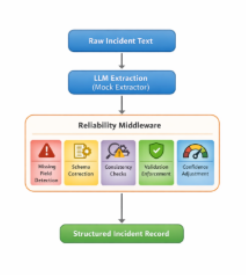

# 🔥 FireForm Reliability Middleware Prototype

A safety-preserving reliability layer for structured emergency incident extraction.

This repository contains a modular middleware prototype designed to sit between a Large Language Model (LLM) extraction system and FireForm’s structured incident schema validator.

The goal is to transform noisy, partially structured incident reports into schema-compliant, logically consistent, and operationally safe structured outputs — without hallucinating missing data.

---

## 🚨 Why This Matters

Emergency reporting systems cannot tolerate:

* Missing operational metadata
* Contradictory severity classifications
* Fabricated location data
* Overconfident corrections

This reliability layer prioritizes:

* Structural validity
* Logical consistency
* Deterministic correction
* Safety over aggressive auto-completion

---

## 🔧 Reliability Middleware Architecture



---

## ⚙️ Middleware Pipeline

### 1. Missing Field Detection

Identifies incomplete extraction outputs.

### 2. Schema-Aware Correction

Normalizes:

* Natural language timestamps ("last night", "yesterday evening")
* Severity inconsistencies
* Recoverable metadata

### 3. Validation Enforcement

Ensures strict compliance with incident schema.

### 4. Cross-Field Consistency Engine

Detects logical contradictions such as:

* Explosion incidents labeled "Low" severity
* Severe fire reports marked "minor"
* High severity events with “no damage” descriptions

### 5. Confidence Calibration

Penalizes inconsistent outputs to avoid unsafe overconfidence.

---

## 📊 Benchmark (Reproducible)

Evaluation conducted on a fixed synthetic dataset (n=150) simulating noisy emergency incident descriptions.

### Results

```
PS C:\Users\manis\OneDrive\Desktop\FireForm-Reliability-Layer> python benchmark_reliability.py

=========== RUNNING TRUE BENCHMARK ===========

Total Test Cases                  : 150

--------------- RAW EXTRACTION ---------------
Missing Field Cases               : 150
Validation Error Cases            : 142

----------- WITH RELIABILITY LAYER -----------
Structured Success Cases          : 67
Validation Error Cases            : 83
Consistency Warnings Raised       : 4

------------------ METRICS -------------------
Raw Missing Rate                  : 100.00%
Raw Validation Error Rate         : 94.67%
Post-Layer Success Rate           : 44.67%

----------- RECOVERABILITY METRICS -----------
Salvageable Raw Cases             : 78
Unrecoverable Raw Cases           : 72
Post-Layer Recovered Cases        : 50

Effective Repair Rate             : 64.10%
Unsafe Guess Count                : 0
----------------------------------------------
```

**Key Result:**
The middleware safely repairs 64.10% of structurally salvageable LLM outputs without introducing fabricated incident attributes.

---

## 🔁 Reproduce Benchmark

```bash
python benchmark_reliability.py
```

Dataset is seeded for deterministic evaluation.

---

## 🛡 Design Principles

* Never fabricate missing operational data
* Reject irrecoverable outputs instead of guessing
* Reduce validation errors without increasing risk
* Preserve traceability between raw text and structured output

---

## 📂 Repository Structure

```
## 📂 Repository Structure

```
FireForm-Reliability-Layer/
│
├── fireform/
│   ├── extraction/
│   │   ├── extractor.py
│   │   └── mock_extractor.py
│   │
│   ├── schema/
│   │   └── incident_schema.py
│   │
│   └── reliability/
│       ├── missing.py
│       ├── validator.py
│       ├── consistency.py
│       ├── correction.py
│       ├── confidence.py
│       └── recoverability.py
│
├── main.py
├── benchmark_reliability.py
├── generate_inputs.py
├── test_pipeline.py
└── README.md
```

```

---

## 🎯 Project Goal

This prototype demonstrates architectural readiness to implement a production-grade reliability middleware layer for FireForm’s multi-agency incident reporting system.

The focus is structural recoverability, logical coherence, and operational safety — not extraction accuracy.

---

## 👨‍💻 Author

Manish Krishna Kandrakota (MANISH-K-07)
B.Tech Computer Science & Engineering
IEEE-published researcher & Open-source contributor
Systems & Reliability Engineering Enthusiast
